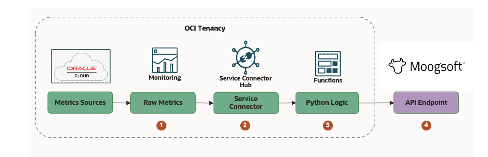
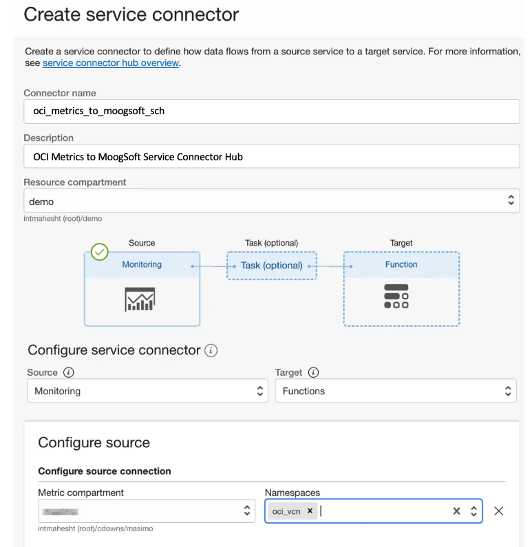

# Exporting OCI Monitoring Service Metrics to MoogSoft

---

## Overview

Let's take a look at bringing Oracle Cloud Infrastructure (OCI)’s rich Metrics resources over to 
MoogSoft to accomplish common goals such DevOps monitoring, application performance monitoring, and so on. 
MoogSoft’s API exposes some unique features. Their API allows you to characterize each metric using tags, 
which is essential to aggregating and correlating data as needed for its monitoring, reporting, dashboards, and so on.

See [MoogSoft's Integration API Overview](https://api.docs.moogsoft.com/docs/latest/branches/main/165686df52254-metrics-integration-api-overview)
and the [MoogSoft format specification](https://api.docs.moogsoft.com/docs/latest/branches/main/7e62a06cd4faa-metric-datum-api-object) for details.

## Prerequisites

If you’re new to Functions, get familiar by running through 
the [Quick Start guide on OCI Functions](http://docs.oracle.com/en-us/iaas/Content/Functions/Tasks/functionsquickstartguidestop.htm) before proceeding.

---
## Solution Architecture

Here is the basic architecture and flow of data from beginning to end:

* OCI services emit metric data which is captured by the Monitoring service.
* The Monitoring Service feeds metric data events to a Service Connector.
* The Service Connector invokes a Function which transforms the metric data payload to MoogSoft format and posts the transformed payload to the MoogSoft REST API.
* MoogSoft ingests the metrics, building its own aggregations using the provided tagging.

Let's drill down into the OCI Services involved.

---
## Monitoring Service

 The [Monitoring Service](https://docs.oracle.com/en-us/iaas/Content/Monitoring/Concepts/monitoringoverview.htm)
 receives timestamp-value pairs (aka metric data points) which also carry contextual 
dimensions and metadata about the services or applications that emitted them. 

---
## Service Connector Hub

The stream of Metric data is event-driven and must be handled on-demand and at scale. The 
[Service Connector Hub](https://docs.oracle.com/en-us/iaas/Content/service-connector-hub/overview.htm) does
exactly that.  See [Service Connector Hub documentation](https://docs.oracle.com/en-us/iaas/Content/service-connector-hub/overview.htm) for details.

---
## Functions Service

I need to transform between the raw metrics formats and some way to make the MoogSoft API calls. The 
[OCI Functions Service](http://docs.oracle.com/en-us/iaas/Content/Functions/Concepts/functionsoverview.htm) is a 
natural fit for the task. Functions integrate nicely with Service Connector Hub as as a target and can scale up
depending on the demand.  That lets me focus on writing the logic needed without needing to address how to 
deploy and scale it.

---
## Mapping From OCI to MoogSoft Formats

A key requirement of course is the mapping of OCI to MoogSoft format.  Let's compare the OCI and MoogSoft
message payload formats, what the mapping needs to accomplish, and see what the resulting transformed message 
looks like.

Example OCI Metrics Payload:
    
    {
      "namespace": "oci_vcn",
      "resourceGroup": null,
      "compartmentId": "ocid1.compartment.oc1...",
      "name": "VnicFromNetworkMirrorBytes",
      "dimensions": {
        "resourceId": "ocid1.vnic.oc1.phx..."
      },
      "metadata": {
        "displayName": "Mirrored Bytes from Network",
        "unit": "bytes"
      },
      "datapoints": [
        {
          "timestamp": 1652196492000,
          "value": 6.0,
          "count": 1
        }
      ]
    }

Example MoogSoft Metrics Payload 
(see [MoogSoft format specification](https://api.docs.moogsoft.com/docs/latest/branches/main/7e62a06cd4faa-metric-datum-api-object)):

    {
        "metric": ""myApp response time msec"m
        "source": "source.server.com", 
        "time": 1571435450540, 
        "data": 1.2345, 
        "tags": {
            "protocol" : "tcp",
            "seq" : 12, 
            "total" : 157, 
            "bytes" : 1274
        } 
    }

Mapping Behavior:

    {
      "metric": "{metdata.displayName}",
      "source": "{re-characterized OCI namespace and metric name values}",
      "time": {datapoint.timestamp},
      "data": {datapoint.value}
      ],
      "tags": [
        "{metrics tag key1:oci payload value}",
        "{metrics tag key2:oci payload_value}"
      ]
    }

Resulting Output:

    {
      "metric": "Mirrored Bytes from Network",
      "source": "oci.vcn.vnic.from.network.mirror.bytes",
      "time": 1652196492000,
      "data": 6.0,
      "tags": [
        "displayName:Mirrored Bytes from Network",
        "name:VnicFromNetworkMirrorBytes",
        "unit:bytes",
        "namespace:oci_vcn"
      ]
    }

---
## Policy Setup

You will need 
this [IAM policy](https://docs.oracle.com/en-us/iaas/Content/Functions/Tasks/functionscreatingpolicies.htm#Create_Policies_to_Control_Access_to_Network_and_FunctionRelated_Resources) 
to authorize the Service Connector to invoke your Function.

    allow any-user to use fn-function in compartment id ocid1.compartment.oc1... where all {request.principal.type=’serviceconnector’, request.principal.compartment.id=’ocid1.compartment.oc1...’}

---
## Service Connector Setup

Now let’s set up a simple service connector instance that takes Monitoring sources and passes them to our Function.

Because your Function requires a VCN, you can use that VCN as the metric source to test against.  Let's test
with the `oci_vcn` Monitoring namespace because it will quickly generate a lot of useful events.

Select Monitoring as the source and the Function as the target. Configure your source as the 
compartment where the VCN resides and select the Monitoring namespace (`oci_vcn`) that you want to
pick up. Select your Application and the Function within it as the target.

 

---
## View Metrics In MoogSoft

When you have the Service Connector configured, metrics appear in MoogSoft's Metrics Explorer and notebooks 
after a few minutes.

## Function Environment

Here are the supported Function parameters:

| Environment Variable        | Default           | Purpose                                                                            |
| ------------- |:-------------:|:-----------------------------------------------------------------------------------|
| API_ENDPOINT      | not-configured | REST API endpoint for reaching MoogSoft                                            |
| API_TOKEN      | not-configured      | API license token obtained from MoogSoft                                           |
| TAG_KEYS | name, namespace, displayName, resourceDisplayName, unit      | OCI Metric Dimensions and metadata to convert to MoogSoft Metric Tags              |
| LOGGING_LEVEL | INFO     | Controls function logging outputs.  Choices: INFO, WARN, CRITICAL, ERROR, DEBUG    |
| FORWARDING_ENABLED | True      | Determines whether messages are forwarded to MoogSoft                              |

---
## Conclusion

You now have a low-maintenance, serverless function that can send raw metrics over to MoogSoft in
near-real time. I encourage you to experiment with the dimensions and metadata tag mappings 
to see which combination works best for your use case.  

See [MoogSoft UI Reference](https://docs.moogsoft.com/moogsoft-cloud/en/moogsoft-ui-reference.html).

---
## **OCI** Related Workshops

LiveLabs is the place to explore Oracle's products and services using workshops designed to 
enhance your experience building and deploying applications on the Cloud and On-Premises.
ur library of workshops cover everything from how to provision the world's first autonomous 
database to setting up a webserver on our world class OCI Generation 2 infrastructure, 
machine learning and much more.  Use your existing Oracle Cloud account, 
a [Free Tier](https://www.oracle.com/cloud/free/) account or a LiveLabs Cloud Account to build, test, 
and deploy applications on Oracle's Cloud.

Visit [LiveLabs](http://bit.ly/golivelabs) now to get started.  Workshops are added weekly, please visit frequently for new content.

---
## License
Copyright (c) 2022, Oracle and/or its affiliates. All rights reserved.
Licensed under the Universal Permissive License v 1.0 as shown at https://oss.oracle.com/licenses/upl.
